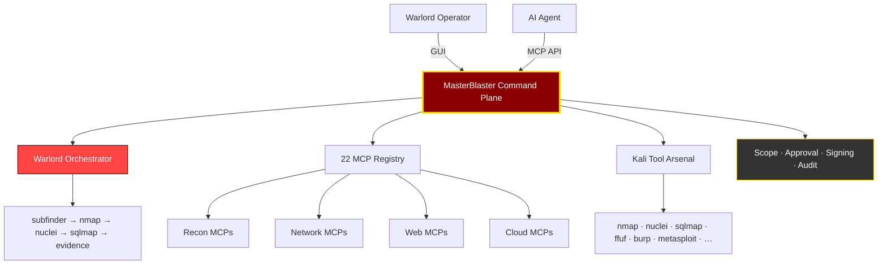

<div align="center">

# ⚔ MASTERBLASTER WARLORD v2.1
### One Interface. 22 MCPs. Total Domination.

[](https://www.python.org/)
[](https://github.com/eregular13/MasterBlaster)
[](https://github.com/eregular13/MasterBlaster)
[](https://github.com/eregular13/MasterBlaster)
[](https://github.com/eregular13/MasterBlaster)
[](https://github.com/eregular13/MasterBlaster)
[](https://github.com/eregular13/MasterBlaster/tree/grokier/masterblaster)
[](https://github.com/eregular13/MasterBlaster)

**The iron fist that cracks the whip on 22 Master Control Programs — forcing nmap, nuclei, sqlmap, ffuf, burp, metasploit-class wrappers, and the full Kali arsenal to execute, chain, coordinate, and surrender evidence.**

**This is the control plane that makes scattered tooling kneel.**

[💀 Crack the Whip](#-crack-the-whip--savage-demo) • [🎯 22 MCP Arsenal](#-22-mcp-arsenal--tool-bindings) • [🏗️ Architecture](#️-warlord-architecture) • [🚀 Deploy](#-deploy-in-60-seconds) • [⚖️ Doctrine](#️-warlord-doctrine)

</div>

---

## 🔥 What Is MasterBlaster WARLORD?

Forget juggling 50 terminal tabs. MasterBlaster is a **fearsome GUI + API command plane** that dominates **22 MCPs** like a warlord commanding an army:

| You Get | What It Does |
| --- | --- |
| **22 MCP slots** | Recon, network, web, cloud, binary, API, evidence — all leashed to one throne |
| **66+ tool bindings** | nmap · rustscan · nuclei · sqlmap · ffuf · feroxbuster · hydra · burp · metasploit · prowler · ghidra · … |
| **Assault chains** | Crack the whip across 8+ MCPs in one coordinated strike |
| **Evidence capture** | Signed jobs, SHA-256 evidence, audit trail — every hit logged |
| **Human approval gate** | You rule the engagement; MasterBlaster enforces scope |
| **AI + MCP API** | Claude, Cursor, Copilot drive the same war machine via stdio/HTTP |

> **Smart governance, savage execution:** Authorized engagements only. Scope-locked targets. Operator approval on every strike. Full audit trail. No chaos — **controlled domination**.

---

## 📊 Warlord Stats

| Metric | Value |
| --- | ---: |
| **Master Control Programs** | **22** |
| **Kali-grade tool bindings** | **66+** |
| **Default assault chain depth** | **8 MCPs** |
| **Parallel queue modes** | Batch · Workflow · Warlord Chain |
| **Policy gate speed** | **< 5ms** |
| **Automated tests** | **140+** |
| **MCP API transports** | stdio + HTTP |

---

## 🏗️ Warlord Architecture



---

## 💀 Crack the Whip — Savage Demo

**8-MCP assault chain** (fast strike) or **12-MCP full assault** (total domination):

```bash
git clone https://github.com/eregular13/MasterBlaster.git
cd MasterBlaster
git checkout grokier/masterblaster
pip install -r requirements.txt

# Fast strike — 8 MCPs
python scripts/demo_warlord_chain.py example.com

# Full assault — 12 MCPs, 30+ tools chained
python scripts/demo_warlord_full_chain.py example.com

# Total domination — all 22 MCPs in registry order
python scripts/demo_warlord_registry_queue.py example.com
```

**Sample chain:**

| Step | MCP | Tools Deployed |
| ---: | --- | --- |
| 1 | `mcp.recon.subdomain` | subfinder, amass, assetfinder |
| 2 | `a5.port.scan_sim` | nmap, rustscan, masscan |
| 3 | `mcp.network.service` | nmap, nmap-scripts, netexec |
| 4 | `a6.web.crawl_sim` | katana, gau, hakrawler |
| 5 | `mcp.web.fuzzer` | ffuf, feroxbuster, gobuster, **nuclei** |
| 6 | `mcp.web.inject` | **sqlmap**, commix, dalfox |
| 7 | `mcp.api.rest` | **burp**, postman, arjun |
| 8 | `mcp.evidence.compiler` | faraday, dradis, plextrac |

```bash
# Launch the command plane
python main.py
# Warlord menu → Crack Full Assault Chain (12 MCPs) | Export chain report
# Guardrails → "Crack Assault Chain (8)" | "Crack Full Chain (12)" | "Kali Tool Bindings"
```

---

## 🎯 22 MCP Arsenal — Tool Bindings

| # | MCP | Tools Under the Whip |
| ---: | --- | --- |
| 01 | `a0.fixture.inventory` | amass, theharvester, assetfinder |
| 02 | `a1.tls.assessment` | testssl.sh, sslscan, sslyze |
| 03 | `a2.dns.posture` | dig, dnsenum, fierce |
| 04 | `a3.http.headers` | curl, httpx, whatweb |
| 05 | `a4.tls.cert_expiry` | openssl, certigo, crt.sh |
| 06 | `a5.port.scan_sim` | **nmap**, rustscan, masscan |
| 07 | `a6.web.crawl_sim` | katana, gau, hakrawler |
| 08 | `a7.live.probe` | naabu, httprobe, tlsx |
| 09 | `mcp.recon.osint` | maltego, recon-ng, spiderfoot |
| 10 | `mcp.recon.subdomain` | subfinder, amass, assetfinder |
| 11 | `mcp.network.service` | nmap, nmap-scripts, netexec |
| 12 | `mcp.network.path` | traceroute, mtr, hping3 |
| 13 | `mcp.web.fuzzer` | **ffuf**, feroxbuster, gobuster, **nuclei** |
| 14 | `mcp.web.inject` | **sqlmap**, commix, dalfox |
| 15 | `mcp.web.auth` | **hydra**, medusa, patator |
| 16 | `mcp.cloud.iam` | prowler, scout-suite, pacu |
| 17 | `mcp.cloud.storage` | trivy, s3scanner, cloudmapper |
| 18 | `mcp.binary.static` | ghidra, radare2, binwalk |
| 19 | `mcp.binary.dynamic` | gdb, strace, **metasploit** |
| 20 | `mcp.api.rest` | **burp**, postman, arjun |
| 21 | `mcp.api.graphql` | graphql-voyager, inql, clairvoyance |
| 22 | `mcp.evidence.compiler` | faraday, dradis, plextrac |

---

## 🚀 Deploy in 60 Seconds

```bash
python -m venv .venv && .venv\Scripts\activate
pip install -r requirements.txt
python -m pytest -q
python scripts/validate_mcp_catalog.py
python main.py
```

**MCP API for AI warlords:**

```bash
python scripts/mcp_http_server.py --port 8765
curl http://127.0.0.1:8765/health
```

---

## ⚙️ Power Features

- **Crack the Whip — All MCPs** — 22-MCP registry queue in catalog order with live dashboard updates
- **Assault chain orchestrator** — 8-step fast strike or 12-step full assault chain
- **Kali tool bindings** — 66+ tools mapped to MCP slots
- **Records + evidence vault** — every strike hashed and stored
- **Plugin marketplace** — extend the army without deserting core
- **Tauri shell** (scaffold) — native wrapper incoming

---

## ⚖️ Warlord Doctrine

Authorized engagements **only**. You own the targets. MasterBlaster owns the orchestration.

- Scope-locked strikes — out-of-scope targets get crushed at the policy gate
- Human approval on every MCP deployment
- Signed job envelopes + immutable evidence
- Full audit trail for client deliverables

Read the full doctrine: [ethics.md](ethics.md)

---

## ⭐ Star This If You Want One Throne for 22 MCPs

```bash
git checkout grokier/masterblaster
python scripts/demo_warlord_chain.py
```

**Fork it. Bind your tools. Crack the whip. Conquer your authorized scope.**

---

<div align="center">

**MASTERBLASTER WARLORD** — *The control plane that makes Kali kneel.*

`grokier/masterblaster` · Built to dominate.

</div>