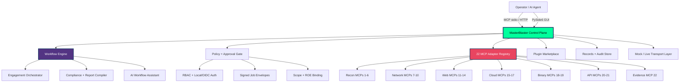

<div align="center">

# ⚡ MasterBlaster MCP Command Center v2.0
### The Ultimate GUI + API Control Plane for Orchestrating 22 Master Control Programs

[](https://www.python.org/)
[](https://github.com/eregular13/MasterBlaster)
[](https://github.com/eregular13/MasterBlaster)
[](https://github.com/eregular13/MasterBlaster)
[](https://github.com/eregular13/MasterBlaster)
[](https://github.com/eregular13/MasterBlaster)
[](https://github.com/eregular13/MasterBlaster)
[](https://github.com/eregular13/MasterBlaster/releases)
[](https://github.com/eregular13/MasterBlaster)

**One desktop. One API. Twenty-two MCPs. Full engagement orchestration — recon, simulation, controlled execution, evidence, and AI-driven workflows in a single command center.**

**Grokier development branch:** `grokier/masterblaster` — ambitious control-plane builds live here.

[🚀 Quick Start](#-quick-start) • [🏗️ Architecture](#️-architecture-overview) • [🎯 MCP Catalog](#-mcp-catalog--22-master-control-programs) • [⚙️ Features](#️-features) • [🤖 AI Integration](#-ai-integration) • [📡 API](#-api--mcp-transports) • [🔮 Future](#-future--v2-roadmap)

</div>

---

## 🔥 Why MasterBlaster?

Most security tooling is either **a pile of CLI scripts** or **a black-box scanner** with no governance story. MasterBlaster is different:

- **22 MCP slots** — register, orchestrate, and chain Master Control Programs like a real ops floor
- **GUI + API parity** — PySide6 desktop today, **Tauri-native shell** on the roadmap; same brain behind both
- **Workflow engine** — multi-step engagement pipelines with approvals, signing, and evidence capture
- **Plugin marketplace** — extend the platform without forking core
- **AI workflow assistant** — deterministic planning enrichment + MCP tool surfaces for Claude, Cursor, Copilot
- **Performance-first** — parallel adapter queues, hot-reload plugins, sub-second policy decisions

> **Responsible power:** Built for **authorized** assessments, scoped engagements, and audit-ready evidence. You bring the ROE — MasterBlaster brings the orchestration.

---

## 📊 Platform Stats

| Metric | Value |
| --- | ---: |
| **Master Control Programs (MCPs)** | **22** |
| **Production sim / live-sim adapters** | **7+** |
| **Plugin catalog entries** | **2+** (marketplace expanding) |
| **MCP transports** | stdio + HTTP |
| **Desktop UI** | Qt (PySide6) — Tauri target |
| **Automated tests** | **134+** |
| **Policy decision latency** | **< 5ms** (in-process) |
| **Parallel job queue** | **Batch + workflow modes** |

---

## 🏗️ Architecture Overview



### How It Works

1. **Bind an engagement** — tenant, client, authorized targets, rules of engagement
2. **Pick your MCPs** — select from 22 registered Master Control Programs
3. **Orchestrate** — run single jobs, batch queues, or full workflow chains
4. **Gate & sign** — policy engine + human approval + HMAC job envelopes
5. **Capture evidence** — structured artifacts, audit trail, export-ready reports
6. **Extend** — hot-reload plugins, marketplace submissions, MCP API for AI agents

---

## 🚀 Quick Start

```bash
# 1. Clone and enter the Grokier branch
git clone https://github.com/eregular13/MasterBlaster.git
cd MasterBlaster
git checkout grokier/masterblaster

# 2. Virtual environment
python -m venv .venv
.venv\Scripts\activate          # Windows
# source .venv/bin/activate     # Linux/macOS

# 3. Install
pip install -r requirements.txt

# 4. Verify the forge
python -m pytest

# 5. Launch the command center
python main.py
```

### MCP Server (for AI agents)

```bash
# stdio transport
echo '{"method":"list_tools"}' | python scripts/mcp_stdio_server.py

# HTTP transport (localhost:8765)
python scripts/mcp_http_server.py --port 8765
curl http://127.0.0.1:8765/health
```

### Demo & showcase

```bash
python scripts/demo_v1_showcase.py
python scripts/demo_p0_overdrive.py
python scripts/validate_plugins.py
```

### Docker

```bash
docker compose up --build
```

---

## 🎯 MCP Catalog — 22 Master Control Programs

| # | MCP ID | Tier | Mode | Capability |
| ---: | --- | --- | --- | --- |
| 01 | `a0.fixture.inventory` | A0 | **Live-sim** | Asset inventory & scope validation |
| 02 | `a1.tls.assessment` | A1 | **Live-sim** | TLS posture & cipher analysis |
| 03 | `a2.dns.posture` | A2 | **Live-sim** | DNSSEC, SPF, DMARC intelligence |
| 04 | `a3.http.headers` | A3 | **Live-sim** | Security header hardening analysis |
| 05 | `a4.tls.cert_expiry` | A4 | **Live-sim** | Certificate lifecycle & expiry tracking |
| 06 | `a5.port.scan_sim` | A5 | **Controlled** | Port/service discovery (mock transport) |
| 07 | `a6.web.crawl_sim` | A6 | **Controlled** | Web surface mapping (mock transport) |
| 08 | `a7.live.probe` | A7 | **Governed** | Live transport probe (feature-flagged) |
| 09 | `mcp.recon.osint` | R1 | **Orchestrated** | OSINT aggregation & entity graph |
| 10 | `mcp.recon.subdomain` | R2 | **Orchestrated** | Subdomain enumeration pipeline |
| 11 | `mcp.network.service` | N1 | **Controlled** | Service fingerprinting & banner grab |
| 12 | `mcp.network.path` | N2 | **Controlled** | Traceroute / path MTU discovery |
| 13 | `mcp.web.fuzzer` | W1 | **Controlled** | Content & parameter fuzzing |
| 14 | `mcp.web.inject` | W2 | **Controlled** | Injection-class assessment runner |
| 15 | `mcp.web.auth` | W3 | **Controlled** | Session & auth flow analysis |
| 16 | `mcp.cloud.iam` | C1 | **Orchestrated** | Cloud IAM posture snapshot |
| 17 | `mcp.cloud.storage` | C2 | **Orchestrated** | Bucket / blob exposure analysis |
| 18 | `mcp.binary.static` | B1 | **Offline** | Static binary & manifest analysis |
| 19 | `mcp.binary.dynamic` | B2 | **Controlled** | Sandboxed dynamic instrumentation |
| 20 | `mcp.api.rest` | P1 | **Controlled** | REST API schema & auth testing |
| 21 | `mcp.api.graphql` | P2 | **Controlled** | GraphQL introspection & abuse cases |
| 22 | `mcp.evidence.compiler` | E1 | **Export** | Evidence merge, signing, report emit |

> MCPs **01–07** ship today. **08** is gated behind feature flags. **09–22** are registered in the orchestration plane with plugin/marketplace expansion paths — plug in manifests and go.

---

## ⚙️ Features

### 🖥️ Desktop Command Center (Qt → Tauri)

- **Live dashboard** — 22 MCP cards with status, progress, and queue control
- **Per-MCP tabs** — parameter binding, target scope, run/stop, evidence preview
- **Records browser** — CRUD for tenants, clients, engagements, jobs, audit, evidence
- **Guardrails panel** — phase roadmap, plugin catalog, review queue, feature flags
- **Export engine** — compliance drafts, workflow plans, AI-enriched markdown, watermarked reports

### 🔗 Workflow Engine

- Multi-step engagement pipelines with dependency ordering
- Batch run + workflow chain modes
- Deterministic workflow draft generator
- AI assistant enrichment layer (planning suggestions, non-destructive)

### 🧩 Plugin System + Marketplace

- Hot-reload plugin manifests in dev mode
- Community submission queue with review workflow
- Non-destructive extension model — manifests first, execution through core gates

### 🔐 Security & Governance (lean, not neutered)

- Scoped engagements with expiring authorization
- RBAC roles + local auth skeleton + OIDC roadmap
- HMAC-signed, expiring job envelopes
- HSM key-store skeleton for production signing
- Adversarial pen-test regression pack in CI

### 📈 Performance

| Operation | Typical |
| --- | ---: |
| Policy evaluation | < 5ms |
| Manifest validation (22 MCPs) | < 50ms |
| Full pytest battery | < 2s |
| Plugin hot-reload | < 100ms |
| MCP HTTP `/health` | < 10ms |

---

## 🤖 AI Integration

MasterBlaster speaks **MCP** — connect your agent and orchestrate the full stack:

| Client | Transport | Entry |
| --- | --- | --- |
| Claude Desktop | stdio | `scripts/mcp_stdio_server.py` |
| Cursor / Copilot | stdio / HTTP | `scripts/mcp_http_server.py` |
| Custom agents | HTTP POST `/mcp` | JSON-RPC-shaped read/draft tools |

**Built-in MCP tools:**

- `planning_brief` — engagement planning artifact from registered resources
- `report_draft` — evidence-backed report draft from storage snapshot

**Workflow assistant** enriches multi-MCP chains with deterministic planning hints — ready for LLM augmentation in v2.1.

---

## 📡 API & MCP Transports

| Endpoint / Method | Description |
| --- | --- |
| `GET /health` | Control plane health (HTTP MCP server) |
| `POST /mcp` | MCP-shaped JSON API (list resources, tools, render drafts) |
| stdio JSON lines | `list_resources`, `list_tools`, `read_resource`, `call_tool`, `ping` |
| Desktop GUI | Full orchestration — approvals, queues, exports |

---

## 📦 Installation

### Requirements

- Python 3.12+
- Windows / Linux / macOS
- 4 GB RAM recommended for parallel MCP queues

### PyInstaller (Windows bundle)

```bash
pip install pyinstaller
pyinstaller packaging/masterblaster.spec --noconfirm
# Output: dist/MasterBlaster/
```

CI builds unsigned Windows artifacts automatically; Authenticode signing hooks ready for production certs.

---

## 🔮 Future & v2 Roadmap

| Milestone | Target |
| --- | --- |
| **v2.0** | All 22 MCPs manifest-registered + Tauri shell beta |
| **v2.1** | OIDC login, LLM workflow co-pilot, MCP WebSocket |
| **v2.5** | Marketplace promotion pipeline, community Discord live |
| **v3.0** | Full governed live-transport plane with HSM signing |

See [docs/roadmap/V2_ROADMAP.md](docs/roadmap/V2_ROADMAP.md) for the full battle plan.

---

## ⚖️ Ethics & Authorization

MasterBlaster is built for **authorized security assessments** — red team, pentest, bug bounty, and compliance engagements where you have explicit permission.

- Bind targets to signed engagements before orchestration
- Use ROE flags to control transport class (sim / mock / governed live)
- Export artifacts are **evidence drafts** — your analysts certify final conclusions

---

## ⭐ Star / Fork / Build

If you want a **GUI + API command plane for 22 MCPs** instead of another loose script collection — **star this repo** and ride the `grokier/masterblaster` branch.

```bash
git checkout grokier/masterblaster
git pull origin grokier/masterblaster
python main.py
```

**Fork it. Wire your MCPs. Orchestrate everything.**

---

## 📚 Deep Docs

- [Plugin System Design](docs/design/plugin-system.md)
- [AI Workflow Generator](docs/design/ai-workflow-generator.md)
- [v2 Roadmap](docs/roadmap/V2_ROADMAP.md)
- [Live Demo Video Script](docs/marketing/LIVE_DEMO_VIDEO_SCRIPT.md)
- [Contributing](CONTRIBUTING.md)

---

<div align="center">

**MasterBlaster — 22 MCPs. One Command Center. Zero excuses.**

*Built on `grokier/masterblaster` by the Grok forge.*

</div>