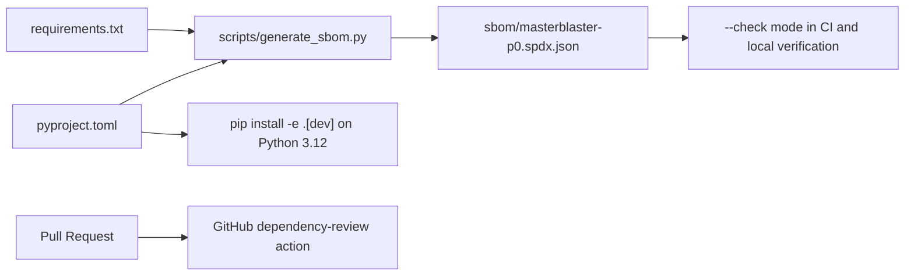

# SBOM And Dependency Review

## Purpose

MasterBlaster P0 uses a small, pinned Python dependency set. The supply-chain control goal is to make dependency drift visible without adding a large dependency solely to generate the inventory.

The supported install target is Python 3.12 because the pinned Qt binding is `PySide6==6.7.0`. The P0 verification workflow installs the project with development extras on Linux and Windows before running the deterministic proof battery.

## SBOM Contents

`sbom/masterblaster-p0.spdx.json` is a deterministic SPDX 2.3 JSON document generated from:

- `pyproject.toml` build-system requirements;
- `pyproject.toml` runtime dependencies;
- `pyproject.toml` optional development dependencies;
- `requirements.txt` pins.

Duplicate pins across files collapse into one SPDX package with an annotation listing every source and scope. The SBOM does not inspect installed environments, virtualenvs, caches, or local machine paths.



## Regeneration

Regenerate the checked-in SBOM after dependency metadata changes:

```bash
python scripts/generate_sbom.py
```

Check that the output is current:

```bash
python scripts/generate_sbom.py --check
```

List the parsed dependency inventory:

```bash
python scripts/generate_sbom.py --list
```

## Dependency Review

`.github/workflows/dependency-review.yml` runs two pull-request jobs with read-only permissions:

- a required deterministic local SBOM drift check using `python scripts/generate_sbom.py --check`;
- GitHub's dependency review action as the vulnerability review check.

The GitHub dependency review action is intended to catch newly introduced vulnerable dependencies or license/security changes visible to GitHub's dependency graph. It is intentionally fail-closed: if Dependency graph support is unavailable, or if the action finds a moderate-or-higher vulnerable dependency, the job fails.

The workflow uses `pull_request`, not `pull_request_target`, and does not expose secrets to untrusted pull-request code.

`.github/workflows/p0-verification.yml` separately installs the project and development dependencies, imports `masterblaster_control.main_window`, imports PySide6 Qt widgets in offscreen mode, and then runs the P0 proof battery. This keeps installability, package data, and Qt import coverage distinct from the dependency-vulnerability review.

## Local Fallback

When GitHub-hosted dependency review is unavailable, `python scripts/generate_sbom.py --check` remains the deterministic local fallback for dependency metadata drift. It is not a substitute for vulnerability review, and acceptance keeps GitHub dependency review externally blocked until the GitHub feature is verified.

`python scripts/validate_p0_registry.py` also invokes the SBOM check so the standard P0 validator fails when dependency metadata and SBOM output drift apart.

## Known Limitations

- The SBOM is dependency-metadata based; it is not an installed-environment inventory.
- A future production SBOM should be generated from a transitive, hash-pinned lock or constraints artifact.
- GitHub dependency review requires repository dependency graph support and appropriate GitHub-side availability. Without it, the GitHub dependency review job fails and the remote criterion remains pending.
- The repository can declare CODEOWNERS and workflows, but maintainers must enable branch protection or repository rulesets before required reviews and checks are enforced remotely.
