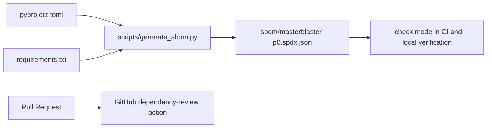

# SBOM And Dependency Review

## Purpose

MasterBlaster P0 uses a small, pinned Python dependency set. The supply-chain control goal is to make dependency drift visible without adding a large dependency solely to generate the inventory.

## SBOM Contents

`sbom/masterblaster-p0.spdx.json` is a deterministic SPDX 2.3 JSON document generated from:

- `pyproject.toml` build-system requirements;
- `pyproject.toml` runtime dependencies;
- `pyproject.toml` optional development dependencies;
- `requirements.txt` pins.

Duplicate pins across files collapse into one SPDX package with an annotation listing every source and scope. The SBOM does not inspect installed environments, virtualenvs, caches, or local machine paths.



## Regeneration

Regenerate the checked-in SBOM after dependency metadata changes:

```bash
python scripts/generate_sbom.py
```

Check that the output is current:

```bash
python scripts/generate_sbom.py --check
```

List the parsed dependency inventory:

```bash
python scripts/generate_sbom.py --list
```

## Dependency Review

`.github/workflows/dependency-review.yml` runs GitHub's dependency review action on pull requests with read-only permissions. It is intended to catch newly introduced vulnerable dependencies or license/security changes visible to GitHub's dependency graph.

The workflow uses `pull_request`, not `pull_request_target`, and does not expose secrets to untrusted pull-request code.

## Local Fallback

When GitHub-hosted dependency review is unavailable, `python scripts/generate_sbom.py --check` is the deterministic local fallback. It detects dependency metadata changes that have not been reflected in the checked-in SPDX document.

`python scripts/validate_p0_registry.py` also invokes the SBOM check so the standard P0 validator fails when dependency metadata and SBOM output drift apart.

## Known Limitations

- The SBOM is dependency-metadata based; it is not an installed-environment inventory.
- GitHub dependency review requires repository dependency graph support and appropriate GitHub-side availability.
- The repository can declare CODEOWNERS and workflows, but maintainers must enable branch protection or repository rulesets before required reviews and checks are enforced remotely.
